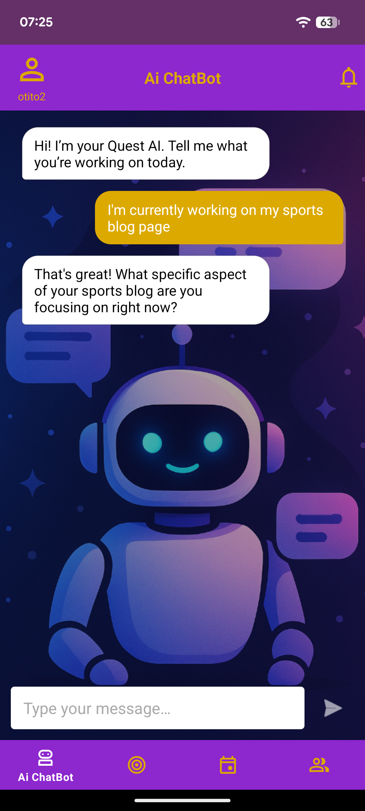
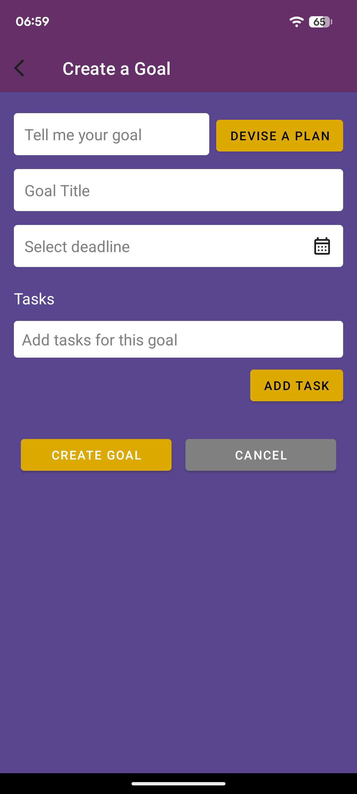
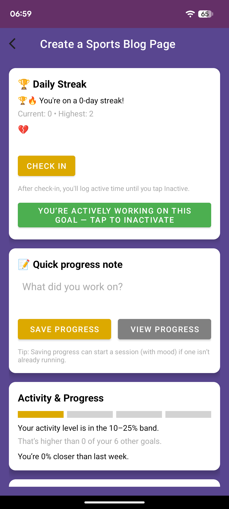
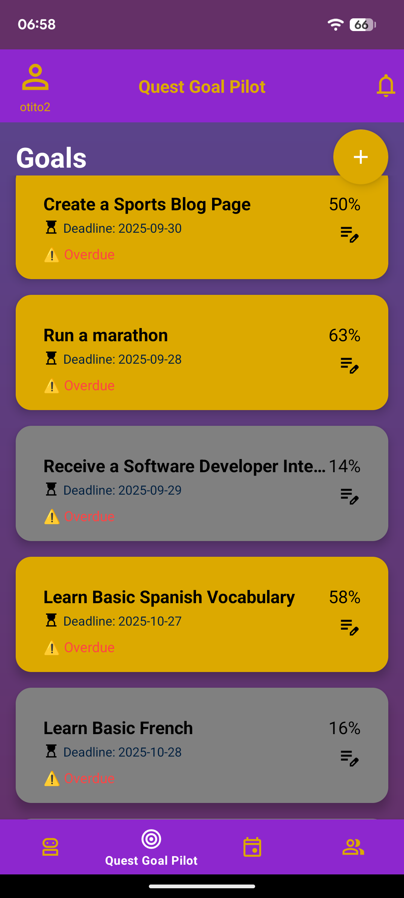
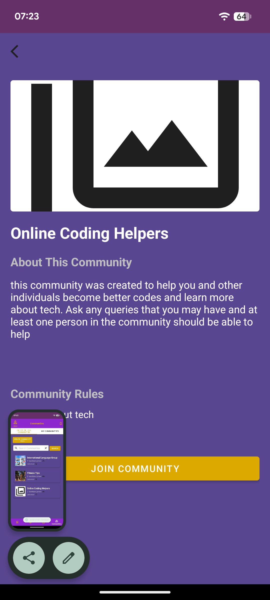
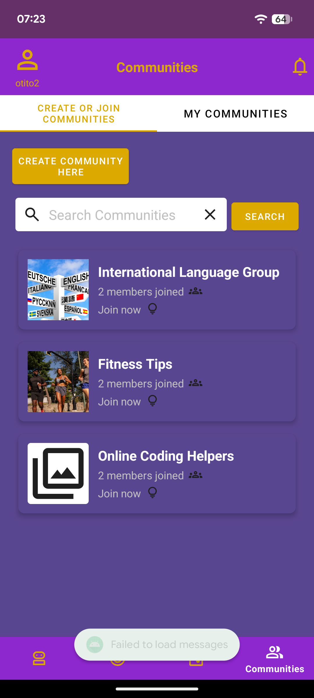
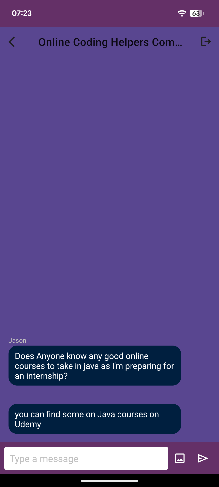

# Quest — AI Goal Tracking App

🔗 **Repository:** https://github.com/Owebgit10/quest-ai-goal-tracker

## Overview
AI-powered Android application that converts natural language goals into structured, actionable task plans using LLM-driven workflows.  
Includes real-time tracking, chatbot-driven refinement, and community-based collaboration.

## Architecture
Client (Android) → Firebase Cloud Functions → OpenAI API → Firebase Realtime Database

## Key Features
- AI-generated goal plans with structured tasks and deadlines  
- Chatbot interface for dynamic goal refinement and guidance  
- Real-time goal tracking with streaks and completion analytics  
- Predictive finish-date estimation based on user activity  
- Community system with group creation and real-time chat  

## AI System
- Structured prompting workflows for consistent task generation  
- Iterative refinement based on user input  
- Context-aware responses tailored to individual goals  

## Communities & Social
- Create and join communities around shared goals  
- Real-time chat within each group  
- Supports collaboration and peer accountability  

## Tech Stack
- Android (Java)  
- Firebase Authentication  
- Firebase Realtime Database  
- Firebase Cloud Functions (Node.js)  
- OpenAI API (GPT-4o-mini)  
- Google Secret Manager  

## How It Works
1. User inputs a goal  
2. Request sent to Firebase Cloud Function  
3. Secure API call to OpenAI  
4. Structured response returned  
5. Data stored in Firebase  
6. UI updates with tasks and analytics  

## Security
- API keys stored in Google Secret Manager  
- No client-side exposure of sensitive data  
- All AI requests handled server-side  
- Input validation and structured response handling  

## Screenshots

### AI Chatbot

### Create Goal

### Goal Stats

### All Goals

### Join Community

### Search Communities

### Chat Room

 ## What I Learned
- Designing secure backend systems using Firebase Cloud Functions
- Handling API calls server-side to protect sensitive keys
- Structuring LLM outputs into usable application workflows
- Building real-time features with Firebase Realtime Database
